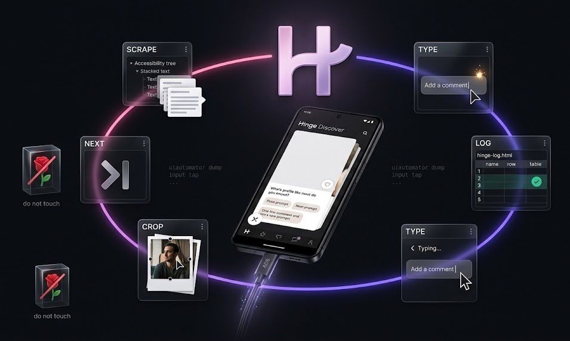

# HingeCRM

A CRM for people you liked on Hinge. The script runs Discover — scrape, draft, send, log, next — and [`hinge-log.html`](hinge-log.html) is the pipeline. Phone locks when you quit.

Never taps the Rose. Against Hinge ToS — you know the risk.

<p align="center">
  
</p>

## Run

[Setup](docs/setup.md) first (adb, USB debugging, `.env`, Pillow). Then Discover open, and:

```bash
npm start              # keep going, 1–5s gap
node hinge.js 8        # stop after 8
npm run dry            # type it, don't send
```

Wireless: `SERIAL=192.168.29.4:5555 node hinge.js`

Same knobs as [`hinge-opener.js`](hinge-opener.js):

| Var | Default | Meaning |
|-----|---------|---------|
| `NUM_LIKES` | no cap | How many to send. Or pass a count: `node hinge.js 8` |
| `MIN_GAP` | `1` | Seconds to wait between profiles (low end) |
| `MAX_GAP` | `5` | Seconds to wait between profiles (high end) |
| `SKIP_MIN` | `6` | Like this many, then pass one (low end) |
| `SKIP_MAX` | `0` | High end. `0` = never pass, like everyone |
| `NO_LOCK` | off | `NO_LOCK=1` leaves the screen on when the run ends |
| `NO_DIM` | off | `NO_DIM=1` leaves brightness alone. Default: dim for the run, restore however it ends |
| `DIM_LEVEL` | `0` | Brightness held during the run |
| `DRY_RUN` | off | `DRY_RUN=1` types the line on one profile, does not send |

First names only in the log, never uploaded. Voice: [`opener-prompt.md`](opener-prompt.md) · [`persona.md`](persona.md).

— [@ajtazer](https://github.com/ajtazer)
